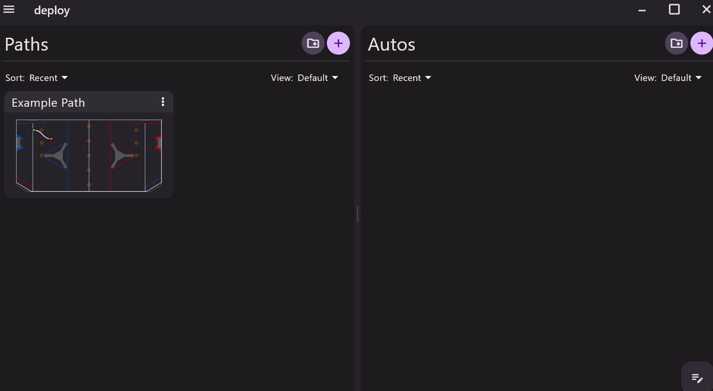

## Control Mappings

|Strafe | Left Joystick |
|Rotate | Right Joystick |
|Pivot-UP | Right Bumper | 
|Pivot-DOWN | Left Bumper |
|Passthrough UP | A Button |
|Passthrough DOWN | B Button |
|Shooter | Right Trigger |
|Intake-IN | X-Button | 
|Intake-OUT | Y-Button |

## Now with Pathplanner!
- Precise path mappings can be found in the deploy folder, and should be under a paths folder
- Below is just a look at the pathplanner interface
